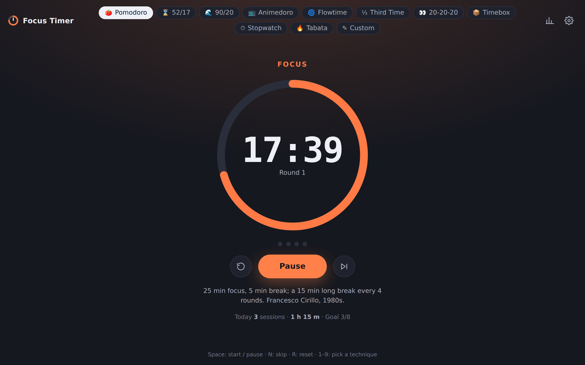
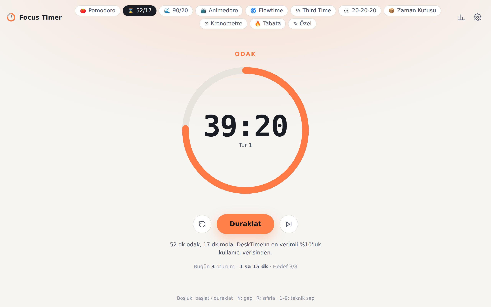
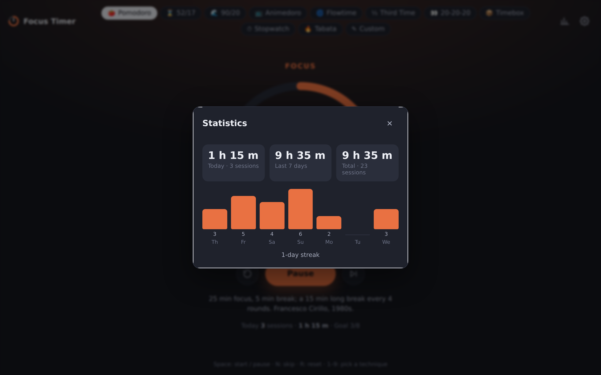

<h1 align="center">Focus Timer</h1>

<p align="center">
  <b>Pomodoro and beyond.</b> Ten productivity timers on one page: no account, no server, works offline, installs as an app.
</p>

<p align="center">
  
</p>

**Live:** https://ardakalper.github.io/focus-timer/

## Why

Every "focus timer" is either a Pomodoro-only page covered in ads, or a subscription app. Different work needs
different rhythms: a 25-minute tomato for chores, a 90-minute block for deep work, no timer at all when you are in
flow, and a 20-second glance away from the screen every 20 minutes for your eyes. This app puts the techniques people
actually use side by side, lets you tune each one, and gets out of the way.

## Techniques

| Technique | Default | Origin |
|---|---|---|
| **Pomodoro** | 25 min focus, 5 min break, 15 min long break every 4 rounds | Francesco Cirillo, late 1980s |
| **52/17** | 52 min focus, 17 min break | DeskTime's 2014 study of its most productive users |
| **90/20** | 90 min focus, 20 min break | Kleitman's ultradian rhythm (~90 min alertness cycles) |
| **Animedoro** | 60 min focus, 20 min break (one episode) | Josh Chang, 2019 |
| **Flowtime** | Open-ended focus, break = focus ÷ 5 | Zoë Read-Bivens, 2015 |
| **Third Time** | Open-ended focus, break = focus ÷ 3 | Alex Vermeer / LessWrong |
| **20-20-20** | Every 20 min, look 20 feet away for 20 s | Ophthalmologists' eye-strain rule |
| **Timebox** | One task, one block of time | Timeboxing |
| **Stopwatch** | Counts up | For measuring how long things really take |
| **Tabata** | 20 s work, 10 s rest, 8 rounds, 10 s prep | Izumi Tabata, 1996 |
| **Custom** | Your own focus / break / long break cycle | You |

Every number is editable per technique and remembered. "Reset to defaults" brings the originals back.

## Features

- **Accurate in the background.** The engine is wall-clock based: a throttled tab, a sleeping laptop or a reload
  never drifts. Phases that ended while you were away are completed at the moment they really ended.
- **Auto-start** breaks and/or focus, or press a key each time. Interval and eye timers always chain.
- **Sound** synthesised in the browser (no files): distinct chimes for focus end, break end, all done; optional tick.
- **Desktop notifications**, countdown in the tab title, and a screen wake lock while running.
- **Daily goal, today's total, streak** and a 7-day chart. Sessions are logged locally; export as JSON any time.
- **Keyboard first:** `Space` start/pause · `N` skip or finish · `R` reset · `1`–`9` pick a technique · `S` settings · `I` stats.
- **Dark and light themes**, English and Turkish, phone-friendly layout.
- **PWA:** installs from the browser, runs offline through a service worker. No build step, no framework, no
  dependencies at runtime: plain HTML, CSS and ES modules.

<p align="center">
  
  
</p>

## Run it locally

```sh
git clone https://github.com/ardakalper/focus-timer
cd focus-timer
npm start            # serves app/ on http://localhost:4173
```

Or open `app/index.html` straight from disk; everything except the service worker works from `file://`.

## Tests

```sh
npm install
npm run test:unit    # engine, presets, i18n, stats  (node --test, no browser)
npm run test:e2e     # Playwright: real browser with a fake clock; phases, persistence, settings, stats
```

The end-to-end suite uses Playwright's clock API, so a whole Tabata or four Pomodoro rounds run in milliseconds.
Set `PW_CHROMIUM_PATH=/path/to/chrome` to reuse an installed Chromium instead of downloading one.

CI runs both suites on every push and deploys `app/` to GitHub Pages when `main` is green.

## How it is built

```
app/
  index.html          the whole UI
  css/app.css         tokens (dark/light), layout, dialogs
  js/engine.js        pure timer state machine: presets -> phases, wall-clock timing, snapshot/restore
  js/presets.js       the techniques, their editable fields and bounds
  js/main.js          DOM controller: rendering, settings, stats, sound, notifications, keyboard, PWA
  js/i18n.js          English and Turkish strings (a test enforces both sets match)
  js/stats.js         session log, daily totals, streak
  js/audio.js         Web Audio chimes and tick
  js/store.js         guarded localStorage
  sw.js               app-shell cache
tests/                node:test unit tests and Playwright e2e specs
tools/                dependency-free static server, PNG icon generator, screenshot script
```

Every technique compiles to the same model: a sequence of phases (`focus`, `short`, `long`, `work`, `rest`,
`prep`, `done`), a round counter and one rule for "what comes next". `engine.js` has no DOM access and takes the
current time as an argument, which is what makes it unit-testable and immune to background-tab throttling.

## License

MIT.

---

### Türkçe özet

**Focus Timer**, tek sayfada on farklı verimlilik zamanlayıcısı: Pomodoro, 52/17, 90/20, Animedoro, Flowtime,
Third Time, 20-20-20, Zaman Kutusu, Kronometre ve Tabata; artı kendi döngünü kurduğun Özel teknik. Hesap yok,
sunucu yok, çevrimdışı çalışır, tarayıcıdan uygulama olarak kurulur. Süreler her teknik için ayrı ayrı
düzenlenir; molaları ve odağı otomatik başlatma, ses, bildirim, sekme başlığında geri sayım, günlük hedef, seri
ve 7 günlük grafik var. Arka planda, uyuyan bilgisayarda ya da sayfa yenilenince zaman şaşmaz. Klavye: `Boşluk`
başlat/duraklat, `N` geç, `R` sıfırla, `1`–`9` teknik seç, `S` ayarlar, `I` istatistik.
